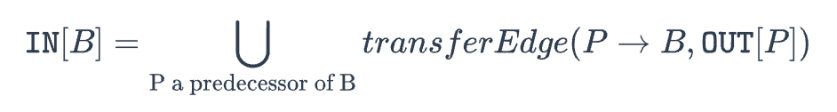

# Tai-e-assignments

## Introduction

南京大学《软件分析》配套的实验，主要是记录做实验写的代码和自己的一些笔记。

## 作业 1：活跃变量分析和迭代求解器

基本算是入门的实验了，因为之前的编译原理课手写过一个编译器并且稍微做过一点后端的优化，所以对于代码有一定的了解，给的各种类基本都知道是干什么的，大概看一下就直接上手了。


总的来说就是实现6个函数，都是非常简单的实现，基本就是简单的初始化，`union`操作。

稍微复杂的要实现的那个大while循环，需要了解一个课上讲的点就是不一定非要从exit开始迭代，课上专门讲了为什么迭代一定会停止，因此从开头开始迭代一样最后是可以结束的，是不过可能要多几轮。

坑点大概是两个，初始化的时候虽然算法里只把IN初始化为空，实际上OUT同样要初始化为空。第二个坑点就是需要对`transferNode`中的类型专门做一下考虑：

```java
        def.ifPresent(lValue -> {
            if (lValue instanceof Var)
                copyOut.remove((Var) lValue);
        });
```

有的左值不能被转换成`Var`，因此需要判断。别的实验一就都很简单了。


此外有一说一，Github copilot插件确实好用，很久没有写过java了，对java的语法来停留在java8阶段，在写代码的过程中用Github copilot插件然后按tab就可以实现功能并且用一些我都没见过的新语法（例如上面的代码块），不得不说现在科技发展太快，各种语言的语法也在不断更新，如果不是常用的话，花时间去学真不如多用插件 tab自己生成，多见一次就会用了，确实究极提高生产力。

## 作业 2：常量传播和 Worklist 求解器

比第一次作业要难蛮多的，ppt的内容是要仔细看的，ppt和作业的介绍里面把可能涉及到的情况都涉及到了。

`newBoundaryFact`要注意的就是还要把函数的参数设置成`getNAC`，`newInitialFact`就是正常的空Fact，`meetInto`和作业一的差不多，需要检测`canHoldInt`。

`meetValue`的处理ppt中也有提到，稍微复杂一点的是`transferNode`。我的做法是首先判断是不是`DefinitionStmt`，不是则`return out.copyFrom(in);`。

判断了是`DefinitionStmt`，就要依次看左值和右值，左值也要`canHoldInt`，右值我建议通过`RValue rValue = ((DefinitionStmt<?, ?>) stmt).getRValue();`，然后开始判断类型，比如字面量，变量，`BinaryExp`等。

`evaluate`比较坑，作业介绍中提到任何东西`/`或者`%`0都会得到`undef`，一定要考虑到第一个操作数不一定是常量，然后再考虑`canHoldInt`，都考虑到就没事。


`initializeForward`和作业一差不多，`doSolveForward`的话需要用队列List`。别的基本没太多的坑点，只要仔细的阅读作业的要求和看ppt就ok。


## 作业 3：死代码检测

要把作业1和2的内容结合起来，去除不可达代码和无用赋值。一些基本的边界初始化和`doSolveBackward`就`doSolveForward`不说了。

不可达代码分为控制流不可达和分支不可达，控制流不可达这个通过遍历一遍CFG就可以知道哪些node没有被遍历到就说明这个node是不可达的，分支不可达我的做法是先遍历一遍所有的node，找到if或者switch，根据常量传播判断条件是否是常量，如果是则将不可达的那个分支的首个node加入到`deadCode`。

然后再遍历一遍`node`，先额外判断是这样一种情况：当前的`node`是死代码，且当前分支的前一个分支没有break，判断的条件是当前的`node`有非死代码的前驱而且有If或者switch语句的前驱（这两个前驱不是同一个前驱）。

如果不是这种情况，则先将当前`node`加入`deadCode`，如果存在非死代码的前驱就将这个`node`从`deadCode`中删除。

最后再遍历一遍`node`，处理无用赋值，这一步比较简单，记得要检查`hasNoSideEffect`。


这是我的原始代码：

```c

    @Override
    public Set<Stmt> analyze(IR ir) {
        // obtain CFG
        CFG<Stmt> cfg = ir.getResult(CFGBuilder.ID);
        // obtain result of constant propagation
        DataflowResult<Stmt, CPFact> constants =
                ir.getResult(ConstantPropagation.ID);
        // obtain result of live variable analysis
        DataflowResult<Stmt, SetFact<Var>> liveVars =
                ir.getResult(LiveVariableAnalysis.ID);
        // keep statements (dead code) sorted in the resulting set


        Set<Stmt> deadCode = new TreeSet<>(Comparator.comparing(Stmt::getIndex));
        // TODO - finish me
        // Your task is to recognize dead code in ir and add it to deadCode
        Set<Stmt> nodes = cfg.getNodes();

        Queue<Stmt> workList = new LinkedList<>();
        workList.add(cfg.getEntry());
        workList.add(cfg.getExit());
        Queue<Stmt> reachNodes = new LinkedList<>();
        while (!workList.isEmpty()) {
            Stmt node = workList.poll();
            if (!reachNodes.contains(node)){
                workList.addAll(cfg.getSuccsOf(node));
                reachNodes.add(node);
            }

        }

        for (Stmt node : nodes) {
            if (deadCode.contains(node)||cfg.isEntry(node)||cfg.isExit(node))
                continue;
            //去除控制流不可达代码
            if (!reachNodes.contains(node)) {
                deadCode.add(node);
            }else if (node instanceof If) {
                ConditionExp condition = ((If) node).getCondition();

                Value evaluateResult = ConstantPropagation.evaluate(condition, constants.getInFact(node));
                if (evaluateResult.isConstant()){
                    if(evaluateResult.getConstant()!=0){
                        cfg.getOutEdgesOf(node).forEach(edge -> {
                            if (edge.getKind() == Edge.Kind.IF_FALSE){
                                deadCode.add(edge.getTarget());
                            }
                        });
                    }else {
                        Stmt ifTarget = ((If) node).getTarget();
                        deadCode.add(ifTarget);
                    }
                }
            } else if (node instanceof SwitchStmt) {
                Value value = constants.getInFact(node).get(((SwitchStmt) node).getVar());
                if (value.isConstant()){
                    int constVal = value.getConstant();
                    //把case遍历完再看default，因为java中default位置可能不一定
                    boolean isMatch = false;
                    Set<Edge<Stmt>> outEdgesOf = cfg.getOutEdgesOf(node);
                    for (Edge<Stmt> edge : outEdgesOf) {
                        if (edge.getKind() == Edge.Kind.SWITCH_CASE){
                            if (edge.getCaseValue()!=constVal){
                                deadCode.add(edge.getTarget());
                            }else {
                                isMatch = true;
                            }
                        }
                    }
                    for (Edge<Stmt> edge : outEdgesOf) {
                        if (edge.getKind() == Edge.Kind.SWITCH_DEFAULT){
                            if (isMatch){
                                deadCode.add(edge.getTarget());
                            }
                        }
                    }
                }
            }
        }


        for (Stmt node : nodes) {
            if (cfg.isEntry(node)||cfg.isExit(node))
                continue;

            Set<Stmt> predsOf = cfg.getPredsOf(node);
            if (deadCode.contains(node)){
                //检查有没有没写break的
                boolean hasNoDeadPred = false;
                boolean predIsIfOrSwitch = false;
                for (Stmt pred : predsOf) {
                    if (pred instanceof If || pred instanceof SwitchStmt){
                        predIsIfOrSwitch = true;
                    }else if (!deadCode.contains(pred)){
                        hasNoDeadPred = true;
                    }
                }
                if (hasNoDeadPred&&predIsIfOrSwitch){
                    deadCode.remove(node);
                }
                continue;
            }
            deadCode.add(node);
            for (Stmt pred : predsOf) {
                if (!deadCode.contains(pred)){
                    deadCode.remove(node);
                    break;
                }
            }
        }
        for (Stmt node : nodes){
            if (node instanceof AssignStmt) {
                LValue lValue = ((AssignStmt<?, ?>) node).getLValue();
                RValue rValue = ((AssignStmt<?, ?>) node).getRValue();
                if (lValue instanceof Var) {
                    Var var = (Var) lValue;
                    if (!liveVars.getOutFact(node).contains(var)) {
                        if (hasNoSideEffect(rValue))
                            deadCode.add(node);
                    }

                }

            }
        }

        return deadCode;
    }

```

后来看了一眼旭神的代码才发现我写的太麻烦了， 完全可以在第一次遍历CFG的时候，将所有的工作都完成。仍然是遍历CFG的流程，但是维护一个`workList`和`liveNodes`，每次遍历到一个`node`时将其加入`liveNodes`，同时判断它是`assignstmt`还是`if`和`switch`，如果是这种情况的话依次处理，对于`if`和`switch`根据条件将可达的路径加入到`workList`，这样遍历CFG的时候就会遍历不到其他不可达的分支，最后再将所有不可达的node加入`deadCode`，非常的优雅

## 作业 4：类层次结构分析与过程间常量传播

要实现的东西ppt里面的算法都给了，基本上就是一些细节上可能会忽略，具体有些忘了只写我还记得的bug。

CHA的实现就是ppt的那三张图，`dispatch`要考虑到返回`null`和方法是抽象方法的情况就没问题，`resolve`的话我卡了的一个点就是`VIRTUAL`和`INTERFACE`的情况下，如果声明的类型是接口，除了要调用`getDirectImplementorsOf`还需要调用`getDirectSubinterfacesOf`，把二者都加入到`worklist`里面。`buildCallGraph`好像没啥坑点。


过程间的常量传播和过程内的常量传播不同的点就是需要引入一个`transferEdge`来增加对`in`的处理，即这张图：



这个`transferEdge`我一开始卡了很久，一直没有想明白就是`transferXXXXEdge`和`transferXXXNode`这两者的关系是什么，我一开始还以为是要在`transferXXXNode`中调用`transferXXXXEdge`，一直没想明白。想了好久才理解到这种设计的思路，`transferXXXXEdge`就是在处理`in`的那一步，处理完`in`之后就会调用`transferXXXNode`，`transferXXXXEdge`这一步只是为处理`in`服务的。理解了这一步再去思考就能明白这两类函数到底要实现什么功能了。对于`transferCallNode`直接返回将`in`复制到`out`就行不需要变化，`transferNonCallNode`就调用正常的`cp.transferNode(stmt, in, out);`

`edge`有四种边，`transferCallToReturnEdge`要把左边的变量删掉，`transferCallEdge`就是函数参数的遍历，基本都没啥问题，稍微复杂一点的就是`transferReturnEdge`，因为要通过`edge.getReturnVars();`来获取返回参数，这个函数的注释里面提到了特殊的情况：

```java
Each method in ICFG has only one exit, but it may have multiple return statements. This API returns all returned variables. E. g., for the return edges starting from the exit of method:
  int foo(...) {
      if (...) {
          return x;
      } else {
          return y;
      }
  }
  
this API returns [x, y].
Returns:
the variables that hold the return values.
```

即返回的参数不同的情况，这种的处理就类似于之前常量传播的`meet`，如果`x`和`y`有一个是`NAC`那么返回值就是`NAC`，如果`x`和`y`是一样的常量那么返回值也是常量，如果`x`和`y`有一个是`UNDEF`，那么直接取另外一个。以这种处理逻辑类推到多个返回参数值的情况来返回判断：

```java
    @Override
    protected CPFact transferReturnEdge(ReturnEdge<Stmt> edge, CPFact returnOut) {
        // TODO - finish me

        CPFact resFact = new CPFact();
        Optional<LValue> def = edge.getCallSite().getDef();
        if (def.isPresent()){
            if (def.get() instanceof Var defVar){
                if (cp.canHoldInt(defVar)){
                    Collection<Var> returnVars = edge.getReturnVars();
                    LinkedList<Value> valueList = new LinkedList<>();
                    boolean isConst = true;
                    boolean isNAC = false;
                    for (Var retVar:returnVars){
                        Value value = returnOut.get(retVar);
                        if (value.isNAC()){
                            isNAC = true;
                            break;
                        } else if (value.isConstant()) {
                            valueList.add(value);
                        }
                    }
                    if (valueList.isEmpty()){
                        isConst = false;
                    }else {
                        for (int i=0;i<valueList.size()-1;i++){
                            if (valueList.get(i)!=valueList.get(i+1)){
                                isConst = false;
                                break;
                            }
                        }
                    }
                    if (isNAC) {
                        resFact.update(defVar, Value.getNAC());
                    } else if (isConst) {
                        resFact.update(defVar, valueList.get(0));
                    } else {
                        resFact.update(defVar, Value.getUndef());
                    }
                }

            }
        }
        return resFact;
    }
```

不过我感觉我写的逻辑还是过于复杂了，不够优雅。此外就是实验要求中的，不可以修改`out`。


最后的`worklist`实现就比较简单了，初始化的时候对于`main`方法设置boundary fact，其他都不用。具体的`worklist`实现也和之前的差不多，除了`in`的处理有变化，要调用`transferEdge`

```java
                Fact edgeOut = analysis.transferEdge(edge, result.getOutFact(edge.getSource()));
                analysis.meetInto(edgeOut, in);
```

## 作业 5：非上下文敏感指针分析

写作业4已经是一个月前的事了，五一假期+五月的其他时间和课程耽误了很多，而且研一快结束了在雁栖湖狠狠玩爽了，所以很久没有写这个了。

作业五也是这个实验通过率最高的，57%的通过率说明基本不会有坑，能把算法实现就能过了。

要实现的是非上下文敏感指针分析，具体的算法课程中也是反复的提及，只不过要加上静态字段、数组和静态方法的处理。

一开始在理解这三个新加的内容上花费了很久的时间，一直没搞懂`addReachable`里到底要多实现哪些东西。后来大概理解了就是，静态字段和`x=y`处理是一样的，数组和`filed`的处理是一样的，然后静态方法在`addReachable`额外处理，因为`processCall`是专门处理其他实例方法调用，即虚调用、接口调用和特殊调用。

一个坑就是所有的指针不要自己`new`，要通过类似`pointerFlowGraph.getVarPtr()`的方式来获得，这样才会把一个指针加入到PFG中，不然PFG中只有指向关系，不会有节点。

以及就是作业中提到的访问者模式，具体可以参考[访问者设计模式](https://refactoringguru.cn/design-patterns/visitor)，以前也没有接触过，原来`accept`方法是用来实现访问者模式的。

还有就是ppt中算法的`reachable statements`是不需要专门存储的，因为在具体的代码中可以通过类似`var.getLoadFields()`的方式去获取对应的`stmt`，不需要一个专门的`reachable statements`来存储。

## 作业 6：上下文敏感的指针分析

基本和上个作业一样的难度，基本没有太多的坑，我被卡一会还是因为读实验说明不仔细了。

首先就是把上下文不敏感的指针分析改成敏感的，也就是带上下文的，这一点很简单了，把实验5的超过来慢慢的加上下文，一开始可能会有的地方上下文会写错，比如调用点和被调用函数的上下文会写混了，但是写到后面的话对于CS指针分析就比较清楚了，回头再看也很容易发现问题。

后面的1-x和2-x那些代码量并不算多，但是要仔细的看实验说明，我就是看漏了导致卡了，主要这三点：

1. 对每个 𝑘 层的 context selector，其堆上下文（heap context）的层数为 𝑘−1

2. 在调用点敏感中，对静态方法选取上下文的规则和实例方法的相同，即，对于一个静态方法调用，我们组合调用者方法的上下文与调用点本身，来构成被调用方法（本次静态方法调用的目标方法）的上下文。在对象敏感和类型敏感中，处理静态方法调用时简单直接地使用调用者方法的上下文作为被调用方法的上下文。本次作业中你需要用上述规则来为静态方法调用选取上下文。（也就是三个函数中的第一个该怎么写）

3. 对于object和type，ppt上都明确写了：receiver object with its heap context as callee context。所以应该取得是`recv.getContext()`

   

解决这些就很容易就过了。

## References

[Java静态分析框架Tai-e的简单使用 - Y4er的博客](https://y4er.com/posts/simple-use-of-the-java-static-analysis-framework-tai-e/)

[Z3ratu1/Tai-e-assignments: Tai-e assignments for static program analysis](https://github.com/Z3ratu1/Tai-e-assignments/tree/main)

[访问者设计模式](https://refactoringguru.cn/design-patterns/visitor)
